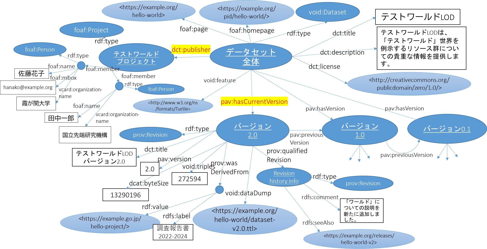

Dataset information
===================

In **ttl2html**, you can describe information about an entire dataset (e.g., title, author, release date, data size) in RDF format and input it into the tool.
The tool then displays this information on the main page and the "About" page, giving users a clear overview before they use the dataset.

The dataset metadata expected by this tool consists of three main parts:

- Metadata for the entire dataset
- Contact information
- Version history information

The basic data structure is illustrated in the following diagram:

   Data model for the dataset information

The table below lists the metadata vocabularies and their namespaces used in the model diagram and in the descriptions that follow:

.. csv-table:: Metadata vocabulary used (prefix and namespace)
   :header:  "Metadata vocabulary", "Prefix", "Namespace URI"
   :widths: auto

   `DCMI Metadata Terms <https://www.dublincore.org/specifications/dublin-core/dcmi-terms/>`_, dct:, http://purl.org/dc/terms/
   `RDF Schema <https://www.w3.org/TR/rdf11-schema/>`, rdfs:, http://www.w3.org/2000/01/rdf-schema#
   `FOAF (Friend of a Friend) Vocabulary <http://xmlns.com/foaf/spec/>`_, foaf:, http://xmlns.com/foaf/0.1/
   `VoID (Vocabulary of Interlinked Datasets) <http://www.w3.org/TR/void/>`_, void:, http://rdfs.org/ns/void#
   `PAV (Provenance Authoring and Versioning ontology) <https://pav-ontology.github.io/pav/>`_, pav:, http://purl.org/pav/
   `DCAT (Data Catalog Vocabulary) <https://www.w3.org/TR/vocab-dcat-3/>`_, dcat:, http://www.w3.org/ns/dcat#
   `PROV-O (PROV ontology) <https://www.w3.org/TR/prov-o/>`_, prov:, http://www.w3.org/ns/prov#

Metadata for the Entire Dataset
-------------------------------

The resource labeled "Entire Dataset" in the model represents the dataset as a whole. 
Metadata about the dataset is attached as properties of this resource.

- A resource linked with ``pav:hasCurrentVersion`` represents the "latest release version" of the dataset and contains details of the available Linked Data. When a resource with this ``pav:hasCurrentVersion`` property is found, this tool determines that dataset information is included and automatically writes out the dataset information.
- A resource linked with ``dct:publisher`` represents the person or organization providing the dataset. This information is displayed as "contact information" in the Linked Data output.
- Resources linked with ``pav:hasVersion`` represent "previous versions" and serve as historical information.

The following properties are available for describing the overall dataset:

.. csv-table:: Properties for Entire Dataset Metadata
   :header: Property, Description
   :widths: auto

   ``rdf:type``, ``void:Dataset``
   ``dct:title``, Title of the dataset
   ``dct:description``, Description of the dataset
   ``dct:license``, Dataset license; use a URI such as a Creative Commons license if possible
   ``foaf:homepage``, URI of the published dataset site
   ``foaf:page``, Additional page for the dataset (if it has a different URI from above)
   ``dct:publisher``, Dataset publisher (see contact information below)

**Example (Turtle):**

.. code-block:: turtle

   @prefix dct:  <http://purl.org/dc/terms/> .
   @prefix foaf: <http://xmlns.com/foaf/0.1/> .
   @prefix void: <http://rdfs.org/ns/void#> .
   @prefix pav:  <http://purl.org/pav/> .
   @prefix ex:   <http://example.org/dataset/> .

   ex:dataset1 a void:Dataset ;
       dct:title "Sample RDF Dataset"@en ;
       dct:description "An example dataset for demonstrating ttl2html metadata"@en ;
       dct:license <https://creativecommons.org/licenses/by/4.0/> ;
       foaf:homepage <http://example.org/dataset/> ;
       dct:publisher ex:project1 ;
       pav:hasCurrentVersion ex:dataset1-v2 ;
       pav:hasVersion ex:dataset1-v1 .

Contact Information
-------------------

The following properties can be used to describe the provider of the dataset.
If the provider consists of multiple people, the contact resource should be represented as an instance of the ``foaf:Project`` class, and each member is linked with the ``foaf:member`` property.

.. csv-table:: Properties for contact information (project/multiple people)
   :header: Properties, description
   :widths: auto

   ``rdf:type``, ``foaf:Project``
   ``foaf:name``,Name of the project
   ``foaf:member``,Member of the project (multiple repetitions possible). Links to resources that represent individuals below.

.. csv-table:: Properties for individual contact information
   :header: Property, Description
   :widths: auto

   ``rdf:type``, ``foaf:Person``
   ``foaf:name``, Name of the individual
   ``foaf:mbox``, Email address
   ``vcard:organization-name``, Name of the organization to which the individual belongs

**Example (Turtle):**

.. code-block:: turtle

   ex:project1 a foaf:Project ;
       foaf:name "Example Project" ;
       foaf:member ex:alice ;
       foaf:member ex:bob .

   ex:alice a foaf:Person ;
       foaf:name "Alice Example" ;
       foaf:mbox <mailto:alice@example.org> ;
       <http://www.w3.org/2006/vcard/ns#organization-name> "Example University" .

   ex:bob a foaf:Person ;
       foaf:name "Bob Example" ;
       foaf:mbox <mailto:bob@example.org> .

Version History Information
---------------------------

Version history information provides details about dataset revisions over time.
This information is represented using the
`PAV (Provenance Authoring and Versioning ontology) <https://pav-ontology.github.io/pav/>`_.

- The latest version is linked from the "Entire Dataset" resource with the ``pav:hasCurrentVersion`` property.
- Past versions are linked with the ``pav:hasVersion`` property.

The following properties can be used for each version resource:

.. csv-table:: Properties for version history information
   :header: Property, Description
   :widths: auto

   ``rdf:type``, ``prov:Dataset``
   ``dct:title``, Version title
   ``pav:version``, Version number
   ``dcat:bytesize``, File size of the dataset
   ``void:triples``, Number of triples in the dataset
   ``void:dataDump``, URI of the dataset file
   ``prov:qualifiedRevision``, Resource describing revision details (can be a blank node)
   ``prov:wasDerivedFrom``, Source resource from which the data was obtained (can be a blank node)

**Example (Turtle):**

.. code-block:: turtle

   ex:dataset1-v2 a prov:Dataset ;
       dct:title "Dataset Version 2.0" ;
       pav:version "2.0" ;
       dcat:byteSize 123456 ;
       void:triples 50000 ;
       void:dataDump <http://example.org/dataset/v2/dump.nt.gz> ;
       prov:qualifiedRevision ex:revnote-v2 ;
       prov:wasDerivedFrom [
         rdf:value <https://example.go.jp/sample-project/> ;
         rdf:label "Project Report 2022-2024" .
       ] .

   ex:revnote-v2 a prov:Revision ;
       rdfs:comment "Second release: added new data and fixed errors in metadata"@en ;
       rdfs:seeAlso <http://example.org/dataset/v2/changelog> .

   ex:dataset1-v1 a prov:Revision ;
       dct:title "Dataset Version 1.0" ;
       pav:version "1.0" ;
       void:triples 30000 ;
       void:dataDump <http://example.org/dataset/v1/dump.nt.gz> .

Revision Details
^^^^^^^^^^^^^^^^^^

The value of ``prov:qualifiedRevision`` may contain the following properties:

.. csv-table:: Properties for revision details
   :header: Property, Description
   :widths: auto

   ``rdf:type``, ``prov:Revision``
   ``rdfs:comment``, Description of the revision
   ``rdfs:seeAlso``, URI with more details on the revision (if available)
