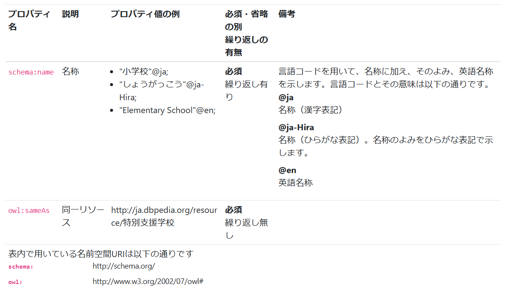

Profile Description Using Shapes
================================

RDF shapes are a formal language for describing the model contents of RDF data. Two common shape description languages are `ShEx (Shape Expressions) <https://shex.io/>`_ and `SHACL (Shapes Constraint Language) <https://www.w3.org/TR/shacl/>`_.
By using ShEx or SHACL, you can verify whether an RDF dataset is correctly structured and provide a detailed description of its contents.

**ttl2html** supports only SHACL, providing two key functions:

* Writing a profile description of the data model by describing the corresponding dataset content in SHACL shape format.

* Assigning labels to property names displayed on the generated site.

Example of Profile Description Using SHACL
------------------------------------------

ttl2html performs profile description and labeling for each class, assuming that a shape is described for each class using ``sh:targetClass`` in SHACL.

In the following example, we use ``SchoolShape``, which represents the "school type" in Japanese Textbook LOD, as an example.

Here is a sample shape description from your dataset file:

.. code-block:: turtle

  @prefix owl: <http://www.w3.org/2002/07/owl#>.
  @prefix schema: <http://schema.org/>.
  @prefix sh: <http://www.w3.org/ns/shacl#>.
  
  <https://w3id.org/jp-textbook/SchoolShape> a sh:NodeShape;
    sh:targetClass <https://w3id.org/jp-textbook/School>;
    sh:property [
      sh:path schema:name;
      sh:name "名称"@ja;
      sh:name "Name"@en;
      sh:description "言語コードを用いて、名称に加え、そのよみ、英語名称を示します。言語コードとその意味は以下の通りです。<dl><dt>@ja</dt><dd>名称（漢字表記）</dd><dt>@ja-Hira</dt><dd>名称（ひらがな表記）。名称のよみをひらがな表記で示します。</dd><dt>@en</dt><dd>英語名称</dd></dl>"@ja;
      sh:description "Using language tags, Japanese name and its transcription and English name are shown. The meanings of language tags are as follows:<dl><dt>@ja</dt><dd>Japanese name (Kanji)</dd><dt>@ja-Hira</dt><dd>Japanese name (Hiragana)</dd><dt>@en</dt><dd>English name</dd></dl>"@en;
      skos:example "<ul><li>\"小学校\"@ja;</li><li>\"しょうがっこう\"@ja-Hira;</li><li>\"Elementary School\"@en;</li></ul>";
      sh:maxCount 3;
      sh:minCount 1;
      sh:languageIn ("ja" "ja-Hira" "en");
      sh:uniqueLang true;
      sh:order 1
    ];
    sh:property [
      sh:path owl:sameAs;
      sh:name "同一リソース"@ja;
      sh:name "Equivalent resource"@en;
      skos:example <http://ja.dbpedia.org/resource/特別支援学校>;
      sh:maxCount 1;
      sh:minCount 1;
      sh:nodeKind sh:IRI;
      sh:order 2
    ] .

As explained above, we assume the shape structure described here specifies the class URI of the corresponding dataset using ``sh:targetClass``.
Using the ``sh:property`` property, you can describe the property name, characteristics, and constraints that resources of the class should have.

Each ``sh:property`` defines a specific attribute of a resource, specifying its characteristics, constraints, and expected values.
This structure helps ensure RDF data is well-organized and adheres to a defined schema.

In this example, the resource is described as having two properties: ``schema:name`` (http://schema.org/name) and ``owl:sameAs`` (http://www.w3.org/2002/07/owl#sameAs).

Explaining Property Description
^^^^^^^^^^^^^^^^^^^^^^^^^^^^^^^

``sh:name`` is the name of the property. On the resource page, the value of sh:name is used as the property name.
If you add a language tag such as ``@ja`` or ``@en`` to the literal, it will specify that the description will be written differently for each language, and the content in the language matching the site's :confval:`locale` will be used.

``skos:example`` gives an example value for that property.

``sh:description`` provides a detailed description of that property.
When generating the page in HTML, you can embed HTML directly in the RDF to include links and structured information in the description.

``sh:order`` specifies the order of the properties.
This order is used to output the properties when generating the description and the pages corresponding to specific resources.

The above profile description is also output as a vocabulary description table in ``about.html`` (you can change the file name with :confval:`about_file`) to make it easier for users of the data model to understand.

The following figure shows an example of the shape description above written out:

It is a table with a description of each property on one line.

The contents written in ``sh:name`` are displayed in the "Description" column.
If you add a language tag such as ``@ja`` or ``@en`` to the literal, it will specify that the description will be written differently for each language. Only the content matching the site's language (:confval:`locale`) will be displayed.
If no language tag is provided, it will be output as-is in all profile descriptions.

The content written with ``skos:example`` will be displayed in the "Example of the property value(s)" column.

If you write ``sh:description``, it will be displayed in the "Notes" column.
You can write both Japanese and English descriptions using language tags (such as ``@ja``).

Descriptions of ``sh:minCount`` and ``sh:maxCount`` will appear in the "Required? / Repeatable?" column.
If ``sh:minCount`` has a value of 1 or more, it is shown as a "Required" property.
If ``sh:minCount`` is absent or set to 0, it is shown as an "Optional" property.
Similarly, if ``sh:maxCount`` is set to 1, the item is shown as "Non repeatable"; if ``sh:maxCount`` is set to 2 or more, the item is shown as "Repeatable".

``sh:order`` specifies the order in which the properties are displayed in the vocabulary description table.
In this example, the order (``sh:order``) of ``schema:name`` property is set to "1", and the order of ``owl:sameAs`` is set to "2".
Thus, the description of ``schema:name`` appears first, followed by ``owl:sameAs``.
