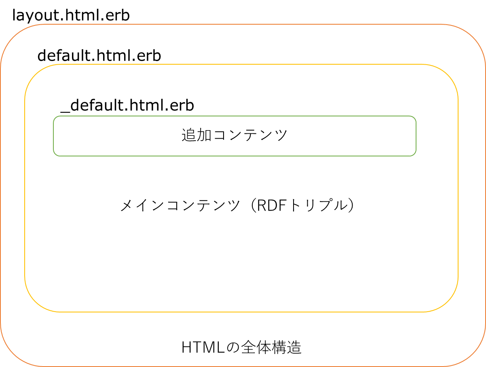
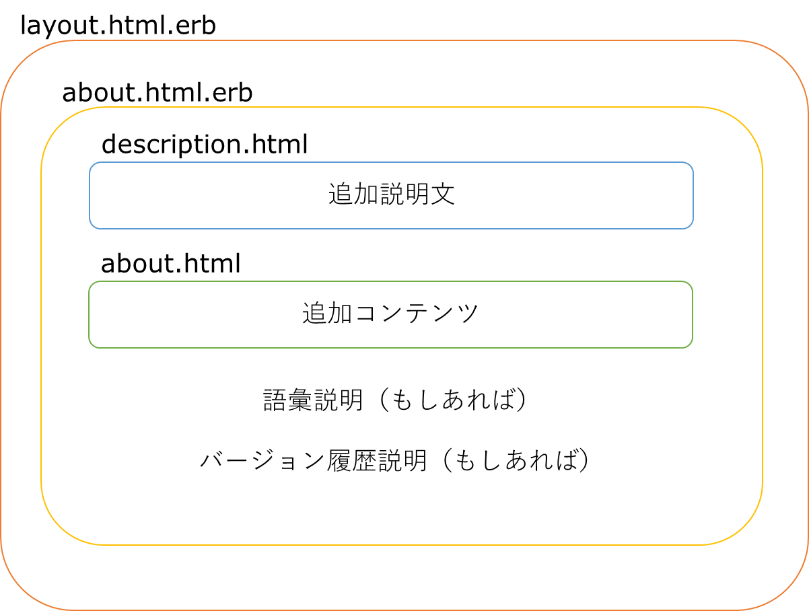
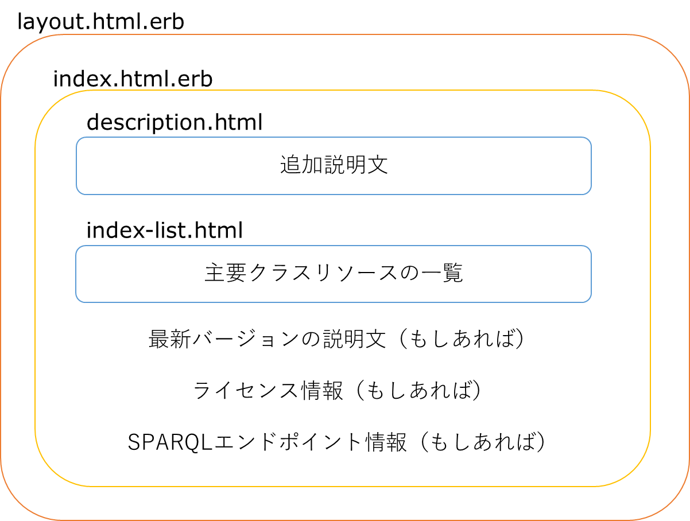

Template Function
=================

Overview
--------

The template function in **ttl2html** allows you to customize the HTML templates that determine the appearance and structure of the generated static website.  
The tool comes with built-in templates that define the basic structure and appearance of the output, so you can build a static site without any customization.  
By default, the HTML output displays the triples of a resource on its page as an organized list of properties.  
By preparing custom templates, you can embed additional site-specific information, change the design and appearance, or add extra functionality.

.. What kind of customization is possible?

Using the template function, you can replace the basic template shared across all pages, embed HTML fragments into resource pages, or build pages that combine JavaScript and CSS to provide dynamic features.  
For example, the following customizations are possible:

* **Layout changes**: Define the HTML structure freely and adjust the overall page design to suit your purpose.
* **Integration with external databases**: Automatically generate links to external databases by using identifiers in the data.

By leveraging this feature, you can go beyond simple RDF-to-HTML conversion and provide flexible information according to your needs.

You can also add custom elements to special pages such as the top page or ``about.html``.

Customization can be achieved by overriding parts of the basic templates or by adding new templates to change the content of the generated pages.

Basic Structure of Templates
----------------------------

.. Required elements (HTML basic structure)

Templates in ttl2html allow you to freely customize layout and design when converting Turtle (TTL) data into HTML.  
They are written in `ERB (Embedded Ruby) format <https://en.wikipedia.org/wiki/ERuby>`_, which lets you embed Ruby code within HTML for flexible data rendering.

The basic structure of the HTML output templates is shown below.

   File structure of template pages

Templates in ttl2html consist of the following three files:

1. layout.html.erb (overall layout)

  ``layout.html.erb`` defines the overall structure of all output HTML files. It sets metadata in the ``<head>`` element, includes CSS and JavaScript, and controls the general ``<body>`` layout where other templates are embedded.

2. default.html.erb (per-page template)

  ``default.html.erb`` renders the content of each resource page and defines how RDF data is displayed.

3. _default.html.erb (partial template; for additional elements)

  ``_default.html.erb`` (note the leading underscore) can be added to include additional elements for individual resource pages.

Among these three, the standard distribution includes ``layout.html.erb`` and ``default.html.erb``.  
If you do not need customization, you can use them as they are.  
``_default.html.erb`` is not included; if you need page-specific insertions, create it in your project.  
The standard templates are available at the  
`templates directory in the GitHub repository <https://github.com/masao/ttl2html/tree/main/templates>`_.  
It is recommended to refer to these, copy them into your project, and then modify as needed.

Variables Available in Templates
--------------------------------

Within templates, you can access RDF data and configuration values through the ``param`` variable.

.. list-table::
   :widths: 25 75
   :header-rows: 1

   * - Variable
     - Description
   * - ``param[:uri]``
     - URI of the resource
   * - ``param[:turtle_uri]``
     - URI of the resource in Turtle format
   * - ``param[:title]``
     - Title label of the resource
   * - ``param[:data]``
     - Triples where the resource is the subject
   * - ``param[:data_inverse]``
     - Triples where the resource is the object
   * - ``param[:site_title]`` etc.
     - Custom values defined in ``config.yml``

Values specified in the configuration file ``config.yml`` can also be accessed through ``param``.  
For example: ``param[:site_title]``, ``param[:admin_name]`` (see :doc:`configuration`).

Examples
^^^^^^^^

**Display title**

.. code-block:: erb

   <h1><%= param[:title] || param[:uri] %></h1>

**Link to Turtle**

.. code-block:: erb

   <% if param[:turtle_uri] %>
     <a href="<%= param[:turtle_uri] %>">Turtle</a>
   <% end %>

**Display property list**

.. code-block:: erb

   <% data = param[:data] || {} %>
   <dl>
     <% data.each do |prop, values| %>
       <dt><%= prop %></dt>
       <dd>
         <% Array(values).each do |v| %>
           <%= v.is_a?(Hash) ? (v[:label] || v[:uri]) : v %> 
         <% end %>
       </dd>
     <% end %>
   </dl>

.. note::
   Wrapping values with ``Array(values)`` ensures safe iteration, even when a property has only a single value.

Structure of Other Pages
------------------------

In addition to individual resource pages derived from RDF data, the tool automatically generates two other pages:  
a dataset description page (``about.html``; see :confval:`about_file`) and the top page (``index.html``).  
Their structures are as follows.

About Page
^^^^^^^^^^

The about page follows the same pattern as the basic template:  
``layout.html.erb`` defines the overall structure, and ``about.html.erb`` renders the page-specific content.  
If you want to add extra site-specific explanations, you can create an ``about.html`` file.  
If a ``description.html`` file exists, its contents are inserted at the beginning of the page.

   HTML structure of the about page

As with resource pages, the standard distribution includes ``layout.html.erb`` and ``about.html.erb``.  
If no customization is needed, they can be used as is.

The tail section of the about page may include LOD vocabulary descriptions generated by the :doc:`shapes` feature, and version history information generated by the :doc:`dataset` feature.

Top Page
^^^^^^^^

The top page also follows the basic pattern:  
``layout.html.erb`` defines the overall structure, and ``index.html.erb`` renders the page-specific content.  
If you want to add additional elements, you can create an ``index-list.html`` file.  
If a ``description.html`` file exists, its contents are inserted at the beginning of the page, similar to the about page.

   HTML structure of the top page (index.html)

As with resource pages, the standard distribution includes ``layout.html.erb`` and ``index-list.html.erb``.  
If no customization is needed, they can be used as is.

The tail section of the top page may include the latest version information, license information, and SPARQL endpoint information generated by the :doc:`dataset` feature.

Customizing Default Templates
-----------------------------

Although the default templates included with ttl2html can be used as is, in many cases you may want to change the appearance or displayed content.  
This section explains where to place templates, the resolution order, and how to customize them.

Template Resolution Order
^^^^^^^^^^^^^^^^^^^^^^^^^

ttl2html uses the built-in templates as a base, but if a file with the same name exists under the project’s ``templates/`` directory, the project file takes precedence.  
A typical resolution order is as follows:

1. If ``templates/layout.html.erb`` exists, it is used. Otherwise, the built-in file is used.
2. If ``templates/default.html.erb`` exists, it is used. Otherwise, the built-in file is used.
3. For page rendering, if a partial template (e.g., ``_default.html.erb``) exists, it will be inserted at the defined position in ``default.html.erb``.

.. note::
   ``_default.html.erb`` is not included in the standard distribution.  
   Create it in your project if you need page-specific elements.

In principle, everything works with the defaults without any configuration.  
You can customize incrementally by overriding only the necessary parts.  
Remember only that “project files take precedence,” and you can safely experiment.

Directory Structure and Placement
^^^^^^^^^^^^^^^^^^^^^^^^^^^^^^^^^

A recommended project structure is shown below.  
Templates placed under ``templates/`` override the built-in ones.

.. code-block:: text

   project-root/
   ├── config.yml
   ├── templates/
   │   ├── _default.html.erb      # page-specific additions (optional)
   │   ├── about.html             # additional elements for about page
   └── assets/
       ├── css/
       │   └── site.css           # custom stylesheet
       ├── js/
       │   └── site.js            # custom script
       └── img/
           └── logo.png           # images

- ``templates/``: ERB templates. Project files take precedence over built-ins.
- ``assets/``: Static resources such as CSS, JavaScript, and images. These are loaded in ``layout.html.erb``.
- Files beginning with an underscore (e.g., ``_default.html.erb``) are partial templates used to insert page-specific elements.

Getting the Default Templates
^^^^^^^^^^^^^^^^^^^^^^^^^^^^^

The default templates are available in the  
`templates/ directory of the GitHub repository <https://github.com/masao/ttl2html/tree/main/templates>`_.  
Create a ``templates/`` directory in your project, copy the necessary files, and then customize them.  
Copying ensures that your modifications are not affected by future updates to the defaults.

Editable Parts and Limitations
^^^^^^^^^^^^^^^^^^^^^^^^^^^^^^

- The HTML structure can be freely modified, but removing ``param`` calls will prevent RDF data from being displayed.
- Accessing undefined keys may cause errors; wrapping with ``Array(...)`` is recommended for safety.
- Do not edit the built-in files directly; always copy them before modifying.

Customization Examples
^^^^^^^^^^^^^^^^^^^^^^

**Example 1**: Adding external database links.

For example, if the resource has a ``dcterms:identifier`` property, you can generate links to an external database using its values:

.. code-block:: erb

   <!-- templates/_default.html.erb -->
   <%# Example: assumes param[:data]["http://purl.org/dc/terms/identifier"] contains IDs %>
   <% ids = Array((param[:data] || {})["http://purl.org/dc/terms/identifier"]) %>
   <% if not ids.empty? %>
     <ul>
     <% ids.each do |id| %>
       <li><a href="https://external.example.org/records/<%= id %>">#<%= id %></a></li>
     <% end %>
     </ul>
   <% end %>

**Example 2**: Adding links only for resources belonging to a specific class.

For example, only when the resource belongs to ``<https://schema.org/Book>``, links are generated:

.. code-block:: erb

   <!-- templates/_default.html.erb -->
   <%# Example: only output external DB links if resource is of class schema:Book %>
   <% types = Array((param[:data] || {})["http://www.w3.org/1999/02/22-rdf-syntax-ns#type"]) %>
   <% if types.include? "https://schema.org/Book" %>
     <% ids = Array((param[:data] || {})["http://purl.org/dc/terms/identifier"]) %>
     <% if not ids.empty? %>
       <ul>
       <% ids.each do |id| %>
         <li><a href="https://external.example.org/records/<%= id %>">#<%= id %></a></li>
       <% end %>
       </ul>
     <% end %>
   <% end %>

Advanced Customization
----------------------

Conditional branching and iteration in ERB
^^^^^^^^^^^^^^^^^^^^^^^^^^^^^^^^^^^^^^^^^^

.. code-block:: erb

   <% if param[:title] %>
     <h1><%= param[:title] %></h1>
   <% end %>

   <% Array(param[:data]).each do |prop, values| %>
     ...
   <% end %>

Using inverse links
^^^^^^^^^^^^^^^^^^^

``param[:data_inverse]`` can be used to list resources that reference the current one.

Troubleshooting
---------------

Common errors and solutions
^^^^^^^^^^^^^^^^^^^^^^^^^^^

- **Nothing is displayed**: Check if you confused ``<%=`` with ``<%``.
- **Undefined error**: Accessing a non-existent key may return nil. RDF data may have missing values or multiple triples.
- **Crash in loops**: If the value is nil, wrap with ``Array(...)`` to avoid errors.

When a template is not applied
^^^^^^^^^^^^^^^^^^^^^^^^^^^^^^

- Check file names and extensions.
- Ensure the file is placed under ``templates/``.
- Inspect the generated HTML to confirm changes.

Debug Tips
^^^^^^^^^^

- Insert ``<pre><%= param.inspect %></pre>`` to check variable contents.  
- Use browser developer tools to inspect the DOM.

References
----------

- ERB reference: `<https://en.wikipedia.org/wiki/ERuby>`_
- Standard templates: `<https://github.com/masao/ttl2html/tree/main/templates>`_
